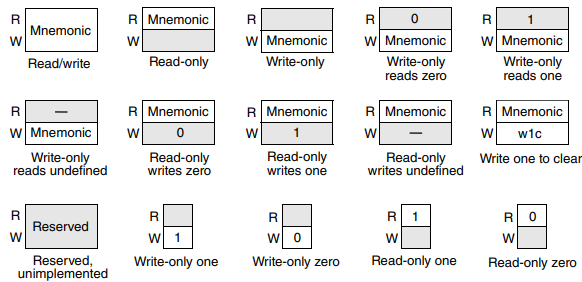

# Chapter 1 About This Manual

## 1.1 Audience

- This reference manual is intended for system software and hardware developers and applications programmers who want to develop products with this device.

- It assumes that the reader understands operating systems, microprocessor system design, and basic principles of software and hardware.

- The manual describes the functionality of the superset device of the S32K1xx and S32K14xW series.

- For the available features, register implementation of a specific derivative (derivative device), please refer to the respective Chip-specific *module* information.

## 1.2 Organization

- This manual has two main sets of chapters.

    1. Chapters in first set contain information that applies to all components on the chip.

    2. Chapters in the second set are organized into functional groupings that detail particular areas of functionality.

        - Examples of these groupings are clocking, timers, and communication interfaces.

        - Each grouping includes chapters that provide a technical description of individual modules.

## 1.3 Module descriptions

- Each module chapter has two main parts:

    - The first section, *Chip-specific [module name] information*, provides details such as the number of module instances on the chip and connections between the module and other modules.

        - Read this section *first* because its content is crucial to understanding the information in other sections of the chapter.

    - The subsequent sections provide general information about the module, including its signals, registers, and functional description.

## 1.4 Register descriptions

- Module chapters present register information in:

    - Memory maps containing:

        - An offset from the module's base address

        - The name and acronym/abbreviation of each register

        - The width of each register (in bits)

        - Each register's reset value

        - The page number on which each register is described

    - Register figures

    - Field-description tables

    - Associated text

- The register figures show the field structure using the conventions in the following figure.

> ##### Figure 1-4. Register figure conventions
>
> 
>
> - Read/write
> 
> - Read-only
> 
> - Write-only
> 
> - Write-only reads zero
> 
> - Write-only reads one
> 
> - Write-only reads undefined
> 
> - Read-only writes zero
> 
> - Read-only writes one
> 
> - Read-only writes undefined
> 
> - Write one to clear
> 
> - Reserved, unimplemented
> 
> - Write-only one
> 
> - Write-only zero
> 
> - Read-only one
> 
> - Read-only zero

## 1.5 Conventions

### 1.5.1 Notes, Cautions, and Warnings

- Note, Caution, and Warning notices appear throughout this manual.

- Each notice type alerts readers to a specific kind of information.

> ##### Note
>
> - Notes convey information that may be tangential to a topic or that may not apply to all readers.

> ##### Caution
>
> - Caution notices call out information that readers should know before taking further action.
>
> - Cautions frequently point to trouble spots that may damage the chip or board.

> ##### Warning
>
> - Warning notices inform readers about actions that could result in unwanted consequences, especially those that may cause bodily injury.

### 1.5.2 Numbering systems

- The following suffixes identify different numbering system:

|This suffix|identifies a|
|-|-|
|b|Binary number. In some cases, binary numbers are shown with the prefix *0b*.|
|d|Decimal number. Decimal numbers are followed by this suffix only when the possibility of confusion exists. In general, decimal numbers are shown without a suffix.|
|h|Hexadecimal number. In some cases, hexadecimal numbers are shown with the prefix *0x*.|

### 1.5.3 Typographic notation

- The following typographic notation is used throughout this document:

#### *placeholder*, x

- Items in italics are placeholders for information that you provide.

- Italicized text is also used for the titles of publications and for emphasis.

- Plain lowercase letters are also used as placeholders for single letters and numbers.

#### `code`

- Fixed-width type indicates text that must be typed exactly as shown. It is used for instruction mnemonics, directives, symbols, subcommands, parameters, and operators.

- Fixed-width type is also used for example code.

- Instruction mnemonics and directives in text and tables are shown in all caps.

#### SR[SCM]

- A mnemonic in brackets represents a named field in a register.

- This example refers to Scaling Mode (SCM) field in the Status Register (SR).

#### REVNO[6:4], XAD[7:0]

- Numbers in brackets and separated by a colon represent either:

    - A subset of a register's named field

        - For example, REVNO[6:4] refers to bits 6-4 that are part of the COREREV field that occupies bits 6-0 of the REVNO register.

    - A continuous range of individual signals of a bus

        - For example, XAD[7:0] refers to signals 7-0 of the XAD bus.

### 1.5.4 Special terms

- The following terms have special meanings:

#### asserted

- Refers to the state of a signal as follows:

    - An active high signal is asserted when high (1).

    - An active-low signal is asserted when low (0).

#### reserved

- Refers to a memory space, register, field, or programming setting.

- Device operation is not guaranteed when reserved locations are written to any value.

    - Do not modify the default value of a reserved programming setting, such as the reset value of a reserved register field.

    - Consider undefined locations in memory to be reserved.

#### w1c

- Write 1 to clear: Refers to a register bitfield that must be written as 1 to be cleared."
