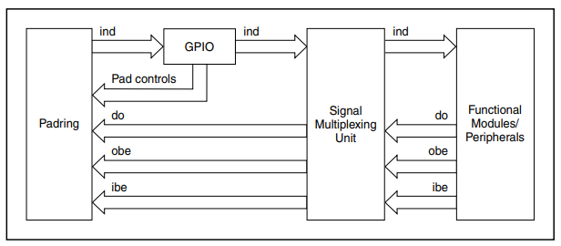
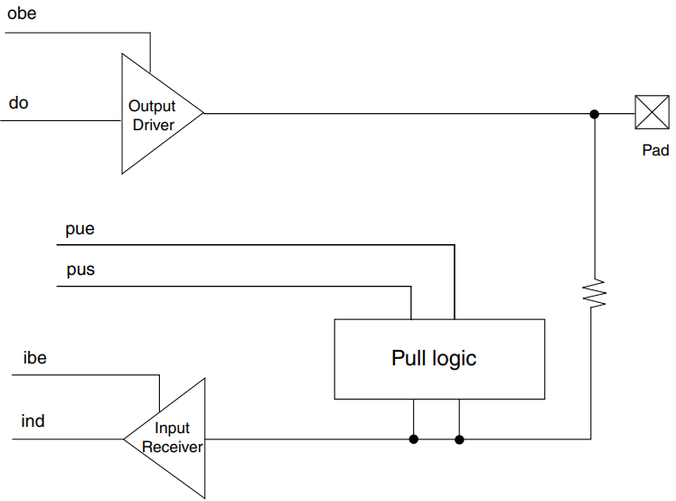

# Chapter 4 Signal Multiplexing and Pin Assignment

## 4.1 Introduction

- The signal multiplexing enables the sharing of single pad for multiple functions.

 

- The signal multiplexing unit comprises of control signals from GPIO, PORT and pad interface logic.

- The signal multiplexing unit consists of several individual sub-units, each handling the signal multiplexing of one pad.

 

- The Port Control block controls the module specific pad settings (pull up etc) and the signal present on the external pin.

- See PORT_PCR for the description of control signals.

- For reset values per port, see IO Signal Description Input Multiplexing sheet(s) attached to the Reference Manual.

## 4.2 Functional description

- The signal multiplexing architectural implementation is as shown in the following figure.

> ##### Figure 4-1. Signal Multiplexing
>
> 

## 4.3 Pad description

- Following figure shows the basic representation of a GPIO Pad.

> ##### Figure 4-2. GPIO pad representation
>
> 

> ##### Table 4-1. Pad Signal description
>
|Signal name|Direction|Description|
|-|-|-|
|pad|I/O|I/O to external world|
|do|I|Data coming from the core into the pad|
|obe|I|Enable output driver|
|pue|I|0: Disable internal pullup or pulldown resistor 1: Enable internal pullup or pulldown register
|pus|I|0: Enable internal pulldown resistor if pue is set 1: Enable internal pullup resistor if pue is set|
|ibe|I|Enable input receiver|
|ind|O|Data coming out of the pad into the core|
