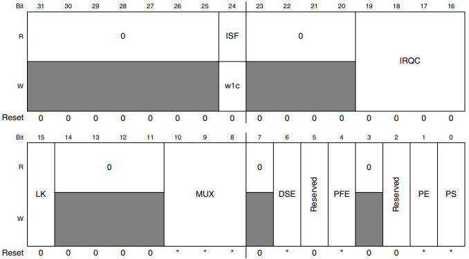

# Chapter 12 Port Control and Interrupt (PORT)

## 12.1 Chip-specific PORT information

- Not all pin control settings mentioned in PORT_PCRn register are configurable for all pins.

- Refer 'Bits Configurable' field in 'IO Signal Table' tab of IO Signal Description Input Multiplexing sheet(s) attached to the Reference Manual.

- The bits apart from 'Bit Configurable' fields are reserved and should not be varied from the reset values.

 

- PCR bits corresponding to reset pad are non-sticky bits and on a functional reset, reset functionality on this pin will be resumed.

- Prior to entering any ALT functionality, PCR of corresponding pad should be properly configured.

 

- On this chip, the pullup and pulldown enables are controllable in analog or disabled pin muxing mode (PORT_PCRn[MUX]=3'b000).

- Before entering Analog mode (ALT0 corresponding to PORT_PCRn[MUX]=3'b000 for corresponding pads for which Analog functionality is available), PUE and PUS should be configured as 0 in corresponding PCR register.

 

- PORT_PCRn[PFE] is configurable for only PTA5 and PTD3.

- See IO Signal Description Input Multiplexing sheet(s) attached to the Reference Manual.

- PFE for these should be configured in ALT7 mode only.

- For other modes, PFE should be kept 0.

 

- The corresponding PAD should be configured for disabled mode(ALT0) prior to configuring PORT_DFER register.

 

- Any pad configuration done in RUN/VLPR mode is retained in low power modes(STOP1, STOP2/VLPS).

 

- Wait mode is not supported on this device.

- See Module operation in available power modes for details on available power modes.

### 12.1.1 Number of PCRs

- The number of PCRs for each PORT varies across the products in the S32K1xx and S32K14xW series.

- The following table shows the number of PCRs for each PORT on each product.

- Memory map and register definition documents the superset number of implemented ports.

- PCR registers corresponding to ports which are not present in a particular device are read only 0.

- See the RM attachments IO Signal Description Input Multiplexing sheet(s) for details on the count of PCRs on each product.

> ##### Table 12-1. PCRs on each product
>
> |PORT|S32K144|
> |-|-|
> |PORT A|18|
> |PORT B|18|
> |PORT C|18|
> |PORT D|18|
> |PORT E|17|

### 12.1.2 Finding address for PORTx_PCRn

- For example, in order to write to the PORT register of PTC3 (PTxn), the corresponding mapped register is PORTC_PCR3 (PORTx_PCRn):

    - To find PORTC base address, look up the 'Start address' of "Port C" in ["Peripheral Memory Map" tab in the attached S32K1xx_Memory_Map.xls](https://github.com/rewls/s32k1xx-series-reference-manual/blob/main/s32k1xx-memory-map.md#peripheral-memory-map).

        - This is referred henceforth as PORTC_Base_address.

    - To reach PCRn, refer toaddress 'PORTx_Base_address + n * 4d'.

        - For PCR3 of PORTC, this refers to 'PORTC_Base_address + 3 * 4d'.

        - The attachmented IO Signal Description Input Muxing sheet(s) for each device provides the fields available in PCR per PORTx_PCRn (For each PTxn pin) in the tab IO Signal Table.

### 12.1.3 I/O configuration sequence

1. Ensure pins for the peripheral are in tristate state (default out of reset).

2. Initialize peripheral clock in the Peripheral Clock Controller register (PCC) and peripheral specific clocking configurations.

3. Configure the peripheral

4. Initialize port clock for the peripheral pins in the Peripheral Clock Controller register (PCC_PORTx).

5. Configure the peripheral pins mux and features in the Port Control and Interrupts register (PORTx_PCRn).

6. Start communication

## 12.2 Introduction

### 12.2.1 Overview

- The Port Control and Interrupt (PORT) module provides support for port control, digital filtering, and external interrupt functions.

 

- Most functions can be configured independently for each pin in the 32-bit port and affect the pin regardless of its pin muxing state.

 

- There is one instance of the PORT module for each port. Not all pins within each port are
implemented on a specific device.

### 12.2.2 Features

- The PORT module has the following features:

    - Pin interrupt

        - Interrupt flag and enable registers for each pin

        - Support for edge sensitive (rising, falling, both) or level sensitive (low, high) configured per pin

        - Support for interrupt or DMA request configured per pin 

        - Asynchronous wake-up in low-power modes

        - Pin interrupt is functional in all digital pin muxing modes

    - Digital input filter

        - Digital input filter for each pin, usable by any digital peripheral muxed onto the pin

        - Individual enable or bypass control field per pin

        - Selectable clock source for digital input filter with a five bit resolution on filter size

        - Functional in all digital pin multiplexing modes

    - Port control

        - Individual pull control fields with pullup, pulldown, and pull-disable support

        - Individual drive strength field supporting high and low drive strength

        - Individual input passive filter field supporting enable and disable of the individual input passive filter

        - Individual mux control field supporting analog or pin disabled, GPIO, and up to six chip-specific digital functions

        - Pad configuration fields are functional in all digital pin muxing modes.

### 12.2.3 Modes of operation

#### 12.2.3.1 Run mode

- In Run mode, the PORT operates normally.

#### 12.2.3.2 Wait mode

- In Wait mode, PORT continues to operate normally and may be configured to exit the Low-Power mode if an enabled interrupt is detected.

- DMA requests are still generated during the Wait mode, but do not cause an exit from the Low-Power mode.

#### 12.2.3.3 Stop mode

- In Stop mode, the PORT can be configured to exit the Low-Power mode via an asynchronous wake-up signal if an enabled interrupt is detected.

 

- In Stop mode, the digital input filters are bypassed unless they are configured to run from the LPO clock source

#### 12.2.3.4 Debug mode

- In Debug mode, PORT operates normally.

## 12.3 External signal description

- The table found here describes the PORT external signal.

> ##### Table 12-2. Signal properties

|Name|Function|I/O|Reset|Pull|
|-|-|-|-|-|
|PORTx[31:0]|External interrupt|I/O|0|-|

> ##### Note
>
> - Not all pins within each port are implemented on each device.

## 12.4 Detailed signal description

- The table found here contains the detailed signal description for the PORT interface.

> ##### Table 12-3. PORT interface -- detailed signal description
>
> - PORTx[31:0]
>
>   - External interrupt
>
>   - State meaning
>
>       - Asserted -- pin is logic 1.
>
>       - Negated -- pin is logic 0.
>
>   - Timing
>
>       - Assertion -- may occur at any time and can assert asynchronously to the system clock.
>
>       - Negation -- may occur at any time and can assert asynchronously to the system clock.

## 12.5 Memory map and register definition

- Any read or write access to the PORT memory space that is outside the valid memory map results in a bus error.

- All register accesses complete with zero wait states.

### PORT memory map

|Address offset (hex)|Register name|Width (in bits)|Access|Reset Value|Section|
|-|-|-|-|-|-|
|0|Pin Control Register n (PORT_PCR0)|32|R_W|See section|12.5.1|
|30|Pin Control Register n (PORT_PCR12)|32|R_W|See section|12.5.1|

### 12.5.1 Pin Control Register n (PORT_PCRn)

> ##### Note
>
> - See the GPIO Configuration section for details on the available functions for each pin
>
>  
>
> - Do not modify pin configuration registers associated with pins that are not available in a reduced-pin package offering.
>
> - Unbonded pins not available in a package are disabled by default to prevent them from consuming power.

- Address: 0h base + 0h offset + (4d * i), where i = 0d to 31d

- Notes:

    - MUX, DSE, PFE, PE, PS fields: Varies by port. See Signal Multiplexing and Signal Descriptions chapter for reset values per port.

#### PORT_PCRn field descriptions

##### 10-8 MUX

- Pin Mux Control

- Not all pins support all pin muxing slots.

    - Unimplemented pin muxing slots are reserved and may result in configuring the pin for a different pin muxing slot.

- The corresponding pin is configured in the following pin muxing slot as follows:

    - 000 Pin disabled (Alternative 0) (analog).

    - 001 Alternative 1 (GPIO).

    - 010 Alternative 2 (chip-specific).

    - 011 Alternative 3 (chip-specific).

    - 100 Alternative 4 (chip-specific).

    - 101 Alternative 5 (chip-specific).

    - 110 Alternative 6 (chip-specific).

    - 111 Alternative 7 (chip-specific).

