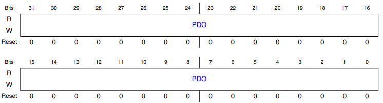
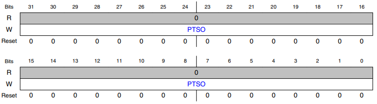
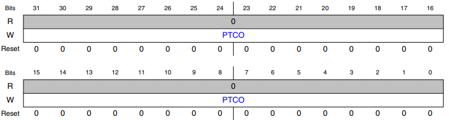
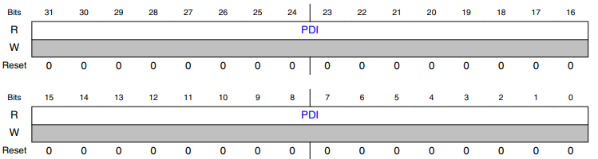

# Chapter 13 General-Purpose Input/Output (GPIO)

## 13.1 Chip-specific GPIO information

### 13.1.1 Instantiation information

- Port control and interrupt module features are supported, each 32-pin port will support a single interrupt.

- Not all pins are available on each package supported.

- See IO Signal Description Input Multiplexing sheet(s) attached to the Reference Manual for the details on which pins are supported in different packages.

- See Port Control and Interrupts (PORT) for details of how to control the ports.

 

- See Module operation in available power modes for details on available power modes.

### 13.1.2 GPIO ports memory map

- This chip implements five instances of GPIOs GPIOA to GPIOE.

- The GPIO register descriptions in this chapter are generic.

- Refer to the table below to see how addresses are allocated to every instance of GPIO in the device memory map.

> ##### Table 13-1. GPIO ports memory map
>
> |Start address|Port|
> |-|-|
> |Base + 0h|Port A|
> |Base + 40h|Port B|
> |Base + 80h|Port C|
> |Base + C0h|Port D|
> |Base + 100h|Port E|

> ##### Note
>
> - In S32K14x, GPIO can only be accessed by the core through the cross bar interface at 0x400F_F000.

||GPIO at 0x400FF000|GPIO at 0x4000F000|GPIO at 0xF8000000|
|-|-|-|-| 
|S32K14x|Accessible in CPO mode|NA|NA|

### 13.1.3 GPIO register reset values

- Following table defines the chip-specific register reset value.

> ##### Table 13-2. GPIO register reset values

|Register|Reset value|
|-|-|
|PDIR|0000_0020|

## 13.2 Introduction

- The general-purpose input and output (GPIO) module communicates to the processor core via a zero wait state interface for maximum pin performance.

- The GPIO registers support 8-bit, 16-bit or 32-bit accesses.

 

- The GPIO data direction and output data registers control the direction and output data of each pin when the pin is configured for the GPIO function.

- The GPIO input data register displays the logic value on each pin when the pin is configured for any digital function, provided the corresponding Port Control and Interrupt module for that pin is enabled.

- Efficient bit manipulation of the general-purpose outputs is supported through the addition of set, clear, and toggle write-only registers for each port output data register.

### 13.2.1 Features

- Features of the GPIO module include:

    - Port Data Input register visible in all digital pin-multiplexing modes

    - Port Data Output register with corresponding set/clear/toggle registers

    - Port Data Direction register

> ##### Note
>
> - The GPIO module is clocked by system clock.

### 13.2.2 Modes of operation

- The following table depicts different modes of operation and the behavior of the GPIO module in these modes.

> ##### Table 13-3. Modes of operation
>
> |Modes of operation|Description|
> |-|-|
> |Run|The GPIO module operates normally.|
> |Stop|The GPIO module is disabled.|
> |Debug|The GPIO module operates normally.|

### 13.2.3 GPIO signal descriptions

> ##### Table 13-4. GPIO signal descriptions
>
> |GPIO signal descriptions|Description|I/0|
> |-|-|-|
> |PORTA31-PORTA0|General-purpose input/output|I/O|
> |PORTB31-PORTB0|General-purpose input/output|I/O|
> |PORTC31-PORTC0|General-purpose input/output|I/O|
> |PORTD31-PORTD0|General-purpose input/output|I/O|
> |PORTE31-PORTE0|General-purpose input/output|I/O|

> ##### Note
>
> - Not all pins within each port are implemented on each device.
>
> - See the chapter on signal multiplexing for the number of GPIO ports available in the device.

#### 13.2.3.1 Detailed signal description

> ##### Table 13-5. GPIO interface-detailed signal descriptions
>
> - PORTA31-PORTA0, PORTB31-PORTB0, PORTC31-PORTC0, PORTD31-PORTD0, PORTE31-PORTE0
>
>   - General-purpose input/output
>
>   - State meaning
>
>       - Asserted: The pin is logic 1.
>
>       - Deasserted: The pin is logic 0.
>
>   - Timing
>
>       - Assertion:
>
>           - When output, this signal occurs on the rising-edge of the system clock
>
>           - For input, it may occur at any time and input may be asserted asynchronously to the system clock.
>
>       - Deassertion:
>
>           - When output, the signal occurs on the rising-edge of the system clock.
>
>           - For input, it may occur at any time and input may be asserted asynchronously to the system clock.

> ##### Note
>
> - Not all pins within each port are implemented on each device.
>
> - See the chapter on signal multiplexing for the number of GPIO ports available in the device.

## 13.3 Memory map and register definition

- The registers for each GPIO port occupy 64-byte of the memory map.

- Any read or write access to the GPIO slot outside this space results in a bus error.

> ##### Note
>
> - For simplicity, each GPIO port's registers appear with the same width of 32 bits, corresponding to 32 pins.
>
> - The actual number of pins per port (and therefore the number of usable control bits per port register) is chip-specific.
>
> - Refer to the chip-specific GPIO information to see the exact control bits for each port.

### 13.3.1 GPIO register descriptions

#### 13.3.1.1 GPIO memory map

- GPIOA base address: 400F_F000h

- GPIOB base address: 400F_F040h

- GPIOC base address: 400F_F080h

- GPIOD base address: 400F_F0C0h

- GPIOE base address: 400F_F100h

|Offset|Register|Width (in bits)|Access|Reset value|
|-|-|-|-|-|
|0h|Port Data Output Register (PDOR)|32|RW|0000_0000h|
|4h|Port Set Output Register (PSOR)|32|WORZ|0000_000h|
|8h|Port Clear Output Register (PCOR)|32|WORZ|0000_000h|
|Ch|Port Toggle Output Register (PTOR)|32|WORZ|0000_000h|
|10h|Port Data Input Register (PDIR)|32|RO|0000_0000h|
|14h|Port Data Direction Register (PDDR)|32|RW|0000_0000h|
|18h|Port Input Disable Register (PIDR)|32|RW|0000_0000h|

#### 13.3.1.2 Port Data Output Register (PDOR)

##### 13.3.1.2.1 Offset

|Register|Offset|
|-|-|
|PDOR|0h|

##### 13.3.1.2.2 Function

- This register configures the logic levels that are driven on each general-purpose output pin.

> ##### NOTE
>
> - Do not modify pin configuration registers associated with pins not available in your selected package.
>
> - All unbonded pins not available in your package will default to DISABLE state for lowest power consumption.

##### 13.3.1.2.3 Diagram

##### 13.3.1.2.4 Fields

###### 31-0 PDO

- Port Data Output

- Register bits for unbonded pins return an undefined value when read.

- 0b - Logic level 0 is driven on pin, provided pin is configured for general-purpose output.

- 1b - Logic level 1 is driven on pin, provided pin is configured for general-purpose output.

#### 13.3.1.3 Port Set Output Register (PSOR)

##### 13.3.1.3.1 Offset

|Register|Offset|
|-|-|
|PSOR|4h|

##### 13.3.1.3.2 Function

- This register configures whether to set the fields of the PDOR.

##### 13.3.1.3.3 Diagram

##### 13.3.1.3.4 Fields

###### 31-0 PTSO

- Port Set Output

- Writing to this register updates the contents of the corresponding bit in the PDOR as follows:

    - 0b - Corresponding bit in PDORn does not change.

    - 1b - Corresponding bit in PDORn is set to logic 1.

#### 13.3.1.4 Port Clear Output Register (PCOR)

##### 13.3.1.4.1 Offset

|Register|Offset|
|-|-|
|PCOR|8h|

##### 13.3.1.4.2 Function

- This register configures whether to clear the fields of PDOR.

##### 13.3.1.4.3 Diagram

##### 13.3.1.4.4 Field

###### 31-0 PTCO

- Port Clear Output

- Writing to this register updates the contents of the corresponding bit in the Port Data Output Register (PDOR) as follows:

    - 0b - Corresponding bit in PDORn does not change.

    - 1b - Corresponding bit in PDORn is cleared to logic 0.

#### 13.3.1.5 Port Toggle Output Register (PTOR)

##### 13.3.1.5.1 Offset

|Register|Offset|
|-|-|
|PTOR|Ch|

##### 13.3.1.5.2 Function

- This register toggles the logic levels that are driven on each general-purpose output pin.

##### 13.3.1.5.3 Diagram

> 

##### 13.3.1.5.4 Fields

###### 31-0 PTTO

- Port Toggle Output

- Writing to this register updates the contents of the corresponding bit in the PDOR as follows:

    - 0b - Corresponding bit in PDORn does not change.

    - 1b - Corresponding bit in PDORn is set to the inverse of its existing logic state.

#### 13.3.1.6 Port Data Input Register (PDIR)

##### 13.3.1.6.1 Offset

|Register|Offset|
|-|-|
|PDIR|10h|

##### 13.3.1.6.2 Function

- This register captures the logic levels that are driven into each general-purpose input pin.

> ##### NOTE
>
> - Do not modify pin configuration registers associated with pins not available in your selected package.
>
> - All unbonded pins not available in your package will default to DISABLE state for lowest power consumption.

##### 13.3.1.6.3 Diagram

##### 13.3.1.6.4 Fields

###### 31-0 PDI

- Port Input Data

- Reads 0 at the unimplemented pins for a particular device.

- Pins that are not configured for a digital function read 0.

- If the Port Control and Interrupt module is disabled, then the corresponding bit in PDIR does not update.

- 0b - Pin logic level is logic 0, or is not configured for use by digital function.

- 1b - Pin logic level is logic 1.

##### 13.3.1.5.1 Offset

#### 13.3.1.7 Port Data Direction Register (PDDR)

##### 13.3.1.7.1 Offset

|Register|Offset|
|-|-|
|PDDR|14h|

##### 13.3.1.7.2 Function

- The PDDR configures the individual port pins for input or output.

##### 13.3.1.7.3 Diagram

##### 13.3.1.7.4 Fields

###### 31-0 PDD

- Port Data Direction

- Configures individual port pins for input or output.

- 0b - Pin is configured as general-purpose input, for the GPIO function.

    - The pin will be high-Z if the port input is disabled in GPIOx_PIDR register.

- 1b - Pin is configured as general-purpose output, for the GPIO function.
