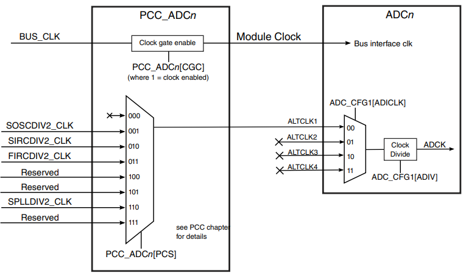

# Chapter 27

- Clock Distribution

## 27.1 Introduction

- This chapter presents the clock architecture overview of this device, clock distribution, module clocks, and clock terminology.

- The System Clock Generator (SCG) module is used to generate most of the clocks used by the device.

- The SCG module controls which clock source (internal references, external crystals, external clocks) is used to derive system clocks.

- The SCG also divides the selected clock source into a variety of clock domains, including clocks for system bus masters, system bus slaves, and flash memory.

 

- The clock generation circuitry provides several clock dividers and selectors allowing different modules to be clocked at a frequency specific for that module.

- Clock generation logic also implements module specific clock gating allowing modules to be individually disabled.

- Thus, allowing optimization for performance or low power.

- Various modules have specific clocks that can be generated from FIRC_CLK, SIRC_CLK, SOSC_CLK, SPLL_CLK, or Power Management Controller (PMC) clock signal (LPO128K_CLK).

- In addition, modules specific clocks that can be configured from alternate sources.

- Clock selection for most modules is controlled by the PCC module.

## 27.6 Module clocks

- The following table summarizes the clocks that can be used by each of the modules.

### Table 27-9. Peripheral module clocking

#### ADC

> 

- The ADC has multiple clock sources.

- Selection is determined by the configuration of PCC_ADCx[PCS].

- The dividers should be configured such that the ADC conversion clock frequency lies within the valid range as per the ADC requirement (see the Data Sheet).
