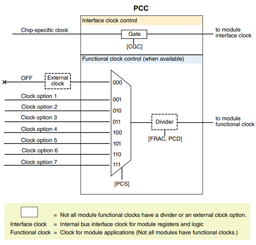
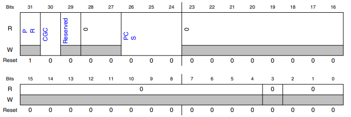
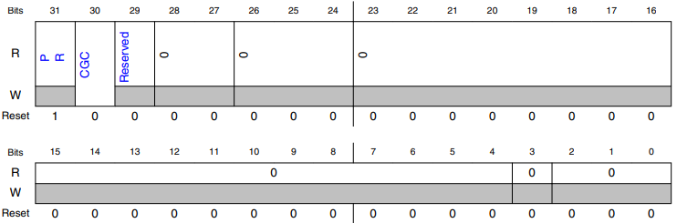

# Chapter 29 Peripheral Clock Controller (PCC)

## 29.1 Chip-specific PCC information

- For module specific clocking, see Module clocks.

> ##### Note
>
> - While change a peripheral clock configurations (clock source divider configuration, etc.), the corresponding module should be disabled:
>
>   - Clock should be CGC gated
>
>   - Module should be disabled by MDIS bit, if available

> ##### Note
>
> - Before clock configuration changes, the user should ensure that module is disabled and not actively communicating / interacting and is in a quiescent state.

- After clock switching, the modeuls should be soft reset using soft reset bit (module software reset bit), if available.

 

- SIM_SDID[FEATURES] bit field overrides the PCC.PR status for the chip.

### 29.1.1 PCC register information

- The PCC memory map shows a superset of registers implemented for the S32K1xx series.

- Registers for instances unavailable in a particular variant are reserved.

## 29.2 Introduction

- The Peripheral Clock Control (PCC) module provides clock control and configuration for on-chip peripherals.

- Each peripheral has its own clock control and configuration register.

## 29.3 Features

- The PCC module enables software to configure the following clocking options for each peripheral:

    - Interface clock gating

    - Functional clock source selection

    - Functional clock divide values

- Below is a block diagram of the PCC module:

> ##### Figure 29-1. PCC Block Diagram
>
> 

## 29.4 Functional description

- The PCC module provides on-chip peripherals (modules) their own dedicated PCC registers for clock gating and configuration options.

- Each module's PCC register contains a clock gating control bit (CGC) for the module's interface clock

- Before a module can be used, its interface clock must be enabled (CGC = 1) in the module's PCC register.

 

- If a module has a functional clock, its PCC register may provide options for the clock source, selected by programming the Peripheral Clock Select (PCS) field.

- Optionally, a module may also have a clock divider, selected by programming the Peripheral Clock Divider (PCD) field along with a Fraction (FRAC) field.

- Before configuring a functional clock, the module's interface clock must be disabled (CGC = 0).

## 29.5 Memory map and register definition

- Each module has its own dedicated PCC register, which controls the clock gating, clock source and divider (when applicable) for that specific module.

- See each module's PCC register for details.

- PCC registers can be written only in supervisor mode using 32-bit accesses.

> ##### Note
>
> - To configure the clocking options available to a given module or to modify an existing configuration, first disable the module's interface clock by writing 0 to its CGC bit.

## 29.6 PCC register descriptions

### 29.6.1 PCC memory map

- PCC base address: 4006_5000h

|Offset|Register|Width (In bits)|Access|Reset value|
|-|-|-|-|-|
|12Ch|PCC PORTC Register (PCC_PORTC)|32|RW|8000_000h|
|130h|PCC PORTD Register (PCC_PORTD)|32|RW|8000_000h|
|ECh|PCC ADC0 Register (PCC_ADC0)|32|RW|8000_0000h|

### 29.6.19 PCC ADC0 Register (PCC_ADC0)

#### 29.6.19.1 Offset

|Register|Offset|
|-|-|
|PCC_ADC0|ECh|

#### 29.6.19.2 Function

- This register is for the ADC0 module.

#### 29.6.19.3 Diagram

#### 29.6.19.4 Fields

##### 30 CGC

- Clock Gate Control

- This read/write bit enables the interface clock for the peripheral, allowing access to the module's registers.

- It also controls whether the clock selection and divider options can be modified.

- 0b - Clock disabled. The current clock selection and divider options are not locked and can be modified.

- 1b - Clock enabled. The current clock selection and divider options are locked and cannot be modified.

##### 26-24 PCS

- Peripheral Clock Source Select

- This read/write bit field is used for peripherals that support various clock selections.  This field can be written only when the clock is disabled (CGC = 0).

- 000b - Clock is off.

- 001b - Clock option 1

- 010b - Clock option 2

- 011b - Clock option 3

- 100b - Clock option 4

- 101b - Clock option 5

- 110b - Clock option 6

- 111b - Clock option 7

### 29.6.24 PCC PORTC Register (PCC_PORTC)

#### 29.6.24.1 Offset

|Register|Offset|
|-|-|
|PCC_PORTC|12Ch|

#### 29.6.25.2 Function

- This register is for the PORTC module.

#### 29.6.25.3 Diagram

#### 29.6.25.4 Fields

##### 31 PR

- Present

- This bit shows whether the peripheral is present on this device.

- 0b - Peripheral is not present.

- 1b - Peripheral is present.

##### 30 CGC

- Clock Gate Control

- This read/write bit enables the interface clock for the peripheral, allowing access to the module's registers.

- It also controls whether the clock selection and divider options can be modified.

- 0b - Clock disabled.

    - The current clock selection and divider options are not locked and can be modified.

- 1b - Clock enabled.

    - The current clock selection and divider options are locked and cannot be modified.

### 29.6.25 PCC PORTD Register (PCC_PORTD)

#### 29.6.25.1 Offset

|Register|Offset|
|-|-|
|PCC_PORTD|130h|

#### 29.6.25.2 Function

- This register is for the PORTD module.

#### 29.6.25.3 Diagram

#### 29.6.25.4 Fields

##### 31 PR

- Present

- This bit shows whether the peripheral is present on this device.

- 0b - Peripheral is not present.

- 1b - Peripheral is present.

##### 30 CGC

- Clock Gate Control

- This read/write bit enables the interface clock for the peripheral, allowing access to the module's registers.

- It also controls whether the clock selection and divider options can be modified.

- 0b - Clock disabled.

    - The current clock selection and divider options are not locked and can be modified.

- 1b - Clock enabled.

    - The current clock selection and divider options are locked and cannot be modified.
