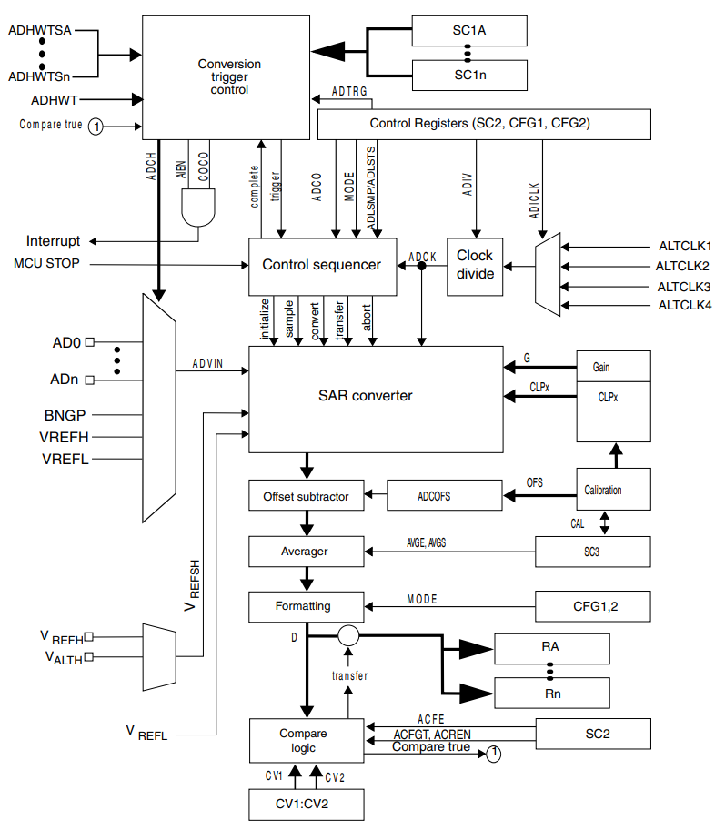
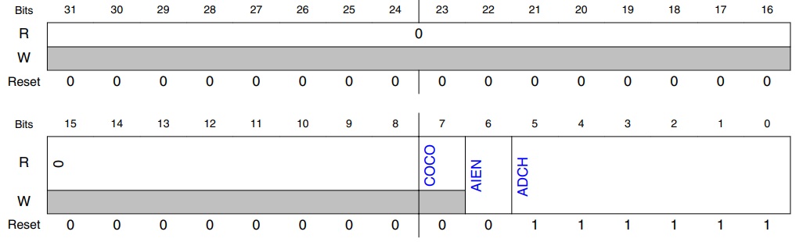
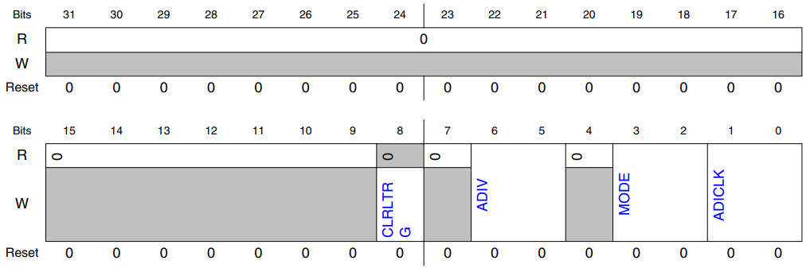
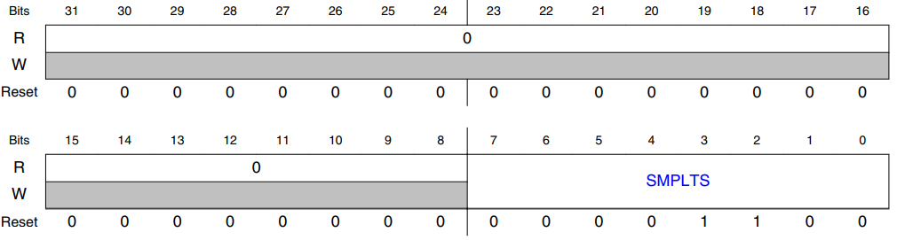
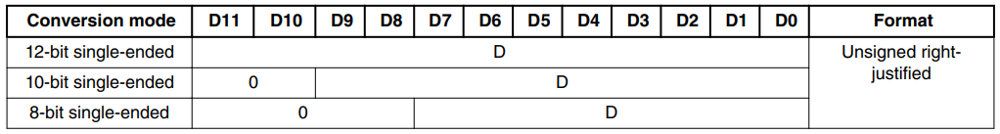
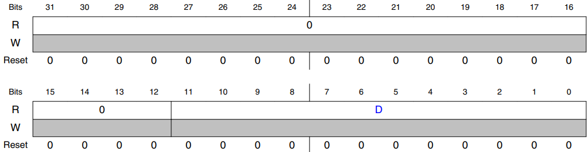
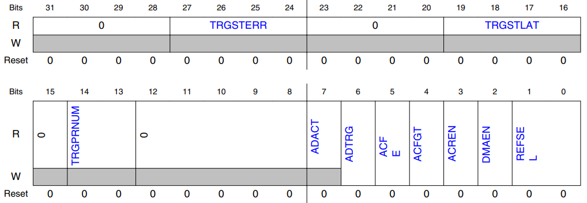
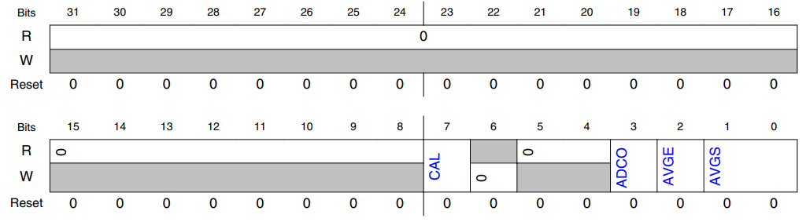

# Chapter 44 Analog-to-Digital Converter (ADC)

## 44.1 Chip-specific ADC information

- See [the ADC Configuration chapter](https://github.com/rewls/s32k1xx-series-reference-manual/blob/main/43-adc-configuration.md).

## 44.2 Introduction

- The 12-bit analog-to-digital converter (ADC) is a successive approximation ADC designed for operation within an integrated microcontroller system-on-chip.

### 44.2.1 Features

- Following are the features of the ADC module:

    - Linear successive approximation algorithm with up to 12-bit resolution

    - Up to 32 single-ended external analog inputs

    - Single-ended 12-bit, 10-bit, and 8-bit output modes

    - Output in right-justified unsigned format for single-ended

    - Single or continuous conversion modes

    - Automatic return to idle after single conversion

    - Configurable sample time and conversion speed/power

    - Conversion complete/hardware average complete flag and interrupt

    - Input clock selectable from up to four sources

    - Operation in low-power modes for lower noise

    - Selectable hardware conversion trigger with hardware channel select

    - Automatic compare with interrupt for less-than, greater-than or equal-to, within range, or out-of-range, programmable value

    - Hardware average function

    - Selectable voltage reference: external or alternate

    - Self-Calibration mode

### 44.2.2 Block diagram

- The following figure is the ADC module block diagram.

> ##### Figure 44-1. ADC block diagram
>
> 

## 44.4 ADC register descriptions

- This section describes the ADC registers.

- All ADC registers support 8-bit, 16-bit, and 32-bit reads, but only 32-bit writes are supported.

- Executing an 8-bit or a 16-bit write will result in a transfer error.

### 44.4.1 ADC Memory map

- ADC0 base address: 4003_B000h

- ADC1 base address: 4002_7000h

|Offset|Register|Width (In bits)|Access|Reset value|
|-|-|-|-|-|
|0h - 3Ch (alias)|ADC Status and Control Register 1 (SC1A - SC1P)|32|RW|0000_003Fh|
|40h|ADC Configuration Register 1 (CFG1)|32|RW|0000_0000h|
|44h|ADC Configuration Register 2 (CFG2)|32|RW|0000_000Ch|
|48h - 84h (alias)|ADC Data Result Registers (RA - RP)|32|RO|0000_0000h|
|88h - 8Ch|Compare Value Registers (CV1 - CV2)|32|RW|0000_0000h|
|90h|Status and Control Register 2 (SC2)|32|RW|0000_0000h|
|94h|Status and Control Register 3 (SC3)|32|RW|0000_0000h|

### 44.4.2 ADC Status and Control Register 1 (SC1A - aSC1P)

#### 44.4.2.1 Offset

- For a = A to P (0 to 15):

    |Register|Offset|
    |-|-|
    |SC1a|0h + (a × 4h)|
    |aSC1a(alias for SC1a)|108h + (a × 4h)|

#### 44.4.2.2 Function

- SC1A is used for both software and hardware trigger modes of operation.

 

- At any one point in time, only one of the SC1n registers is actively controlling ADC sequential conversions.

- Updating SC1A while SC1n is actively controlling a conversion is allowed, and vice versa for any of the SC1n registers specific to this MCU.

 

- Writing to the SC1A register while SC1A is actively controlling a conversion aborts the current conversion.

- In Software Trigger mode (when SC2[ADTRG]=0), writes to SC1A initiate a new conversion.

- This is valid for all values of SC1A[ADCH] other than all 1s (module disabled).

 

- Writing any of the SC1n registers while that specific SC1n register is actively controlling a conversion aborts the current conversion.

- None of the SC1B-SC1n registers are used for software trigger operation and therefore writes to the SC1BSC1n registers do not initiate a new conversion.

#### 44.4.2.3 Diagram

#### 44.4.2.4 Fields

##### 7 COCO

- This is a read-only field that is set each time a conversion is completed when one or more of the following is true:

    - The compare function is disabled

    - SC2[ACFE]=0 and the hardware average function is disabled

    - SC3[AVGE]=0

- If the compare result is true, then COCO is set upon completion of a conversion if one or more of the following is true:

    - The compare function is enabled

    - SC2[ACFE]=1

- COCO is set upon completion of the selected number of conversions (determined by AVGS) if one or more of the following is true:

    - The hardware average function is enabled

    - SC3[AVGE]=1

- COCO in SC1A is also set at the completion of a calibration sequence.

- COCO is cleared when one of the following is true:

    - The respective SC1n register is written

    - The respective Rn register is read

- 0b - Conversion is not completed.

- 1b - Conversion is completed.

##### 6 AIEN

- Interrupt Enable

- Enables conversion complete interrupts.

- When COCO becomes set while the respective AIEN is high, an interrupt is asserted.

- 0b - Conversion complete interrupt is disabled.

- 1b - Conversion complete interrupt is enabled.

##### 5-0 ADCH

- Input channel select

 

- Selects one of the input channels.

> ##### NOTE
>
> - Some of the input channel options in the bitfield-setting descriptions might not be available for your chip.
>
> - For the actual ADC channel assignments for your device, see the chip-specific information.

- The successive approximation converter subsystem is turned off when the channel bits are all set (i.e. ADCH set to all 1s).

- This feature allows explicit disabling of the ADC and isolation of the input channel from all sources.

- Terminating continuous conversions this way prevents an additional single conversion from being performed.

- It is not necessary to set ADCH to all 1s to place the ADC in a low-power state when continuous conversions are not enabled because the module automatically enters a low-power state when a conversion completes.

- 111111b - Module is disabled

### 44.4.3 ADC Configuration Register 1 (CFG1)

#### 44.4.3.1 Offset

|Register|Offset|
|-|-|
|CFG1|40h|

#### 44.4.3.2 Function

- Configuration Register 1 (CFG1) selects the mode of operation, clock source, clock divide.

#### 44.4.3.3 Diagram

#### 44.4.3.4 Fields

##### 6-5 ADIV

- Clock Divide Select

- Selects the divide ratio used by the ADC to generate the internal clock ADCK.

    - 00b - The divide ratio is 1 and the clock rate is input clock.

    - 01b - The divide ratio is 2 and the clock rate is (input clock)/2.

    - 10b - The divide ratio is 4 and the clock rate is (input clock)/4.

    - 11b - The divide ratio is 8 and the clock rate is (input clock)/8.

##### 3-2 MODE

- Conversion mode selection

- Selects the ADC resolution.

    - 00b - 8-bit conversion.

    - 01b - 12-bit conversion.

    - 10b - 10-bit conversion.

    - 11b - Reserved

### 44.4.4 ADC Configuration Register 2 (CFG2)

#### 44.4.4.1 Offset

|Register|Offset|
|-|-|
|CFG2|44h|

#### 44.4.4.2 Function

- Configuration Register 2 (CFG2) selects the long sample time duration during long sample mode.

> ##### NOTE
>
> Writing 0 is not supported on this register.

#### 44.4.4.3 Diagram

#### 44.4.4.4 Fields

##### 7-0 SMPLTS

- Sample Time Select

- Selects a sample time of 2 to 256 ADCK clock cycles.

- The value written to this register field is the desired sample time minus 1.

- A sample time of 1 is not supported.

- Allows higher impedance inputs to be accurately sampled or conversion speed to be maximized for lower impedance inputs.

- Longer sample times can also be used to lower overall power consumption when continuous conversions are enabled if high conversion rates are not required.

### 44.4.5 ADC Data Result Registers (RA - aRP)

#### 44.4.5.1 Offset

- For a = A to P (0 to 15):

    |Register|Offset|
    |-|-|
    |Ra|48h + (a × 4h)|
    |aRa (alias for Ra)|188h + (a × 4h)|

#### 44.4.5.2 Function

- The data result registers (Rn) contain the result of an ADC conversion of the channel selected by the corresponding status and channel control register (SC1A:SC1n).

- For every status and channel control register, there is a corresponding data result register.

- Unused bits in Rn are cleared.

- The following table describes the behavior of the data result registers in the different modes of operation.

> ##### Table 44-2. Data result register description
>
> 

- D: Data.

- The data result registers are read-only; writing to these registers generates a transfer error.

#### 44.4.5.3 Diagram

#### 44.4.5.4 Fields

##### 11-0 D

- Data result

### 44.4.7 Status and Control Register 2 (SC2)

#### 44.4.7.1 Offset

|Register|Offset|
|-|-|
|SC2|90h|

#### 44.4.7.2 Function

- The status and control register 2 (SC2) contains the conversion active, hardware/software trigger select, compare function, and voltage reference select of the ADC module.

#### 44.4.7.3 Diagram

#### 44.4.7.4 Fields

##### 7 ADACT

- Conversion Active

- Indicates that a conversion or hardware averaging is in progress.

- ADACT is set when a conversion is initiated and cleared when a conversion is completed or aborted.

- 0b - Conversion not in progress.

- 1b - Conversion in progress.

##### 6 ADTRG

- Conversion Trigger Select

- Selects the type of trigger used for initiating a conversion. Two types of triggers can be selected:

    - Software trigger: When software trigger is selected, a conversion is initiated following a write to SC1A.

    - Hardware trigger: When hardware trigger is selected, a conversion is initiated following the assertion of the ADHWT input after a pulse of the ADHWTSn input.

- 0b - Software trigger selected.

- 1b - Hardware trigger selected.

##### 5 ACFE

- Compare Function Enable

- Enables the compare function.

- 0b - Compare function disabled.

- 1b - Compare function enabled.

### 44.4.8 Status and Control Register 3 (SC3)

#### 44.4.8.1 Offset

|Register|Offset|
|-|-|
|SC3|94h|

#### 44.4.8.2 Function

- The Status and Control Register 3 (SC3) controls the calibration, continuous conversion, and hardware averaging functions of the ADC module.

#### 44.4.8.3 Diagram

##### 7 CAL

- Calibration

- When CAL=1, the ADC begins the calibration sequence.

- This field stays set while the calibration is in progress and is cleared when the calibration sequence is completed.

- After it is started, the calibration routine cannot be interrupted by writes to the ADC registers or the results will be invalid.

- Setting CAL will abort any current conversion.

> ##### NOTE
>
> - For calibration, it is mandatory to use averaging and average number 32.

> ##### NOTE
>
> - If several ADCs are on a device, they should be calibrated sequentially.
>
> - No parallel calibrations of ADCs are allowed because they will disturb each other.

##### 3 ADCO

- Continuous Conversion Enable

- Enables continuous conversions.

- 0b - One conversion will be performed (or one set of conversions, if AVGE is set) after a conversion is initiated.

- 1b - Continuous conversions will be performed (or continuous sets of conversions, if AVGE is set) after a conversion is initiated.

##### 2 AVGE

- Hardware Average Enable

- Enables the hardware average function of the ADC.

- 0b - Hardware average function disabled.

- 1b - Hardware average function enabled.

##### 1-0 AVGS

- Hardware Average Select

- Determines how many ADC conversions will be averaged to create the ADC average result.

- 00b - 4 samples averaged.

- 01b - 8 samples averaged.

- 10b - 16 samples averaged.

- 11b - 32 samples averaged.
